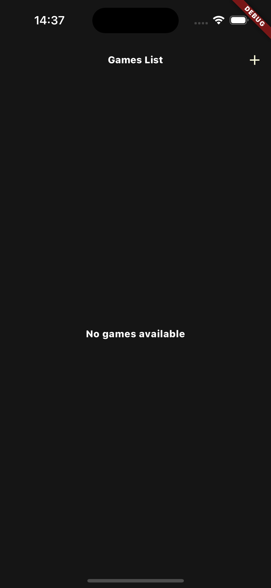

<p align="center">
  
</p>
<p align="center">
    <h1 align="center">TICTACTOE_CASE</h1>
</p>
<p align="center">
	
	
	
	
<p>
<p align="center">
		<em>Developed with the software and tools below.</em>
</p>
<p align="center">
	
	
	
	
	
	
	
</p>

##  Overview

That application has created for Chant Social Case Study.
Project uses MVVM, default state management, Repository Pattern


##  Repository Structure

```sh
└── tictactoe_case/
    ├── LICENSE
    ├── README.md
    ├── analysis_options.yaml
    ├── android
    │   ├── .gitignore
    │   ├── app
    │   │   ├── build.gradle
    │   │   └── src
    │   │       ├── debug
    │   │       │   └── AndroidManifest.xml
    │   │       ├── main
    │   │       │   ├── AndroidManifest.xml
    │   │       │   ├── kotlin
    │   │       │   └── res
    │   │       └── profile
    │   │           └── AndroidManifest.xml
    │   ├── build.gradle
    │   ├── gradle
    │   │   └── wrapper
    │   │       └── gradle-wrapper.properties
    │   ├── gradle.properties
    │   ├── settings.gradle
    │   └── tictactoe_case_android.iml
    ├── ios
    │   ├── .gitignore
    │   ├── Flutter
    │   │   ├── AppFrameworkInfo.plist
    │   │   ├── Debug.xcconfig
    │   │   └── Release.xcconfig
    │   ├── Podfile
    │   ├── Podfile.lock
    │   ├── Runner
    │   │   ├── AppDelegate.swift
    │   │   ├── Assets.xcassets
    │   │   │   ├── AppIcon.appiconset
    │   │   │   │   ├── Contents.json
    │   │   │   │   ├── Icon-App-1024x1024@1x.png
    │   │   │   │   ├── Icon-App-20x20@1x.png
    │   │   │   │   ├── Icon-App-20x20@2x.png
    │   │   │   │   ├── Icon-App-20x20@3x.png
    │   │   │   │   ├── Icon-App-29x29@1x.png
    │   │   │   │   ├── Icon-App-29x29@2x.png
    │   │   │   │   ├── Icon-App-29x29@3x.png
    │   │   │   │   ├── Icon-App-40x40@1x.png
    │   │   │   │   ├── Icon-App-40x40@2x.png
    │   │   │   │   ├── Icon-App-40x40@3x.png
    │   │   │   │   ├── Icon-App-60x60@2x.png
    │   │   │   │   ├── Icon-App-60x60@3x.png
    │   │   │   │   ├── Icon-App-76x76@1x.png
    │   │   │   │   ├── Icon-App-76x76@2x.png
    │   │   │   │   └── Icon-App-83.5x83.5@2x.png
    │   │   │   └── LaunchImage.imageset
    │   │   │       ├── Contents.json
    │   │   │       ├── LaunchImage.png
    │   │   │       ├── LaunchImage@2x.png
    │   │   │       ├── LaunchImage@3x.png
    │   │   │       └── README.md
    │   │   ├── Base.lproj
    │   │   │   ├── LaunchScreen.storyboard
    │   │   │   └── Main.storyboard
    │   │   ├── Info.plist
    │   │   └── Runner-Bridging-Header.h
    │   ├── Runner.xcodeproj
    │   │   ├── project.pbxproj
    │   │   ├── project.xcworkspace
    │   │   │   ├── contents.xcworkspacedata
    │   │   │   └── xcshareddata
    │   │   │       ├── IDEWorkspaceChecks.plist
    │   │   │       └── WorkspaceSettings.xcsettings
    │   │   └── xcshareddata
    │   │       └── xcschemes
    │   │           └── Runner.xcscheme
    │   ├── Runner.xcworkspace
    │   │   ├── contents.xcworkspacedata
    │   │   └── xcshareddata
    │   │       ├── IDEWorkspaceChecks.plist
    │   │       └── WorkspaceSettings.xcsettings
    │   └── RunnerTests
    │       └── RunnerTests.swift
    ├── lib
    │   ├── core
    │   │   ├── constants.dart
    │   │   ├── di
    │   │   │   ├── app_module.dart
    │   │   │   ├── locator.config.dart
    │   │   │   └── locator.dart
    │   │   ├── localdata
    │   │   │   └── local_data_source.dart
    │   │   ├── model
    │   │   │   └── game.dart
    │   │   ├── repository
    │   │   │   └── games_repository.dart
    │   │   └── theme
    │   │       ├── app_colors.dart
    │   │       ├── app_textstyle.dart
    │   │       └── app_theme.dart
    │   ├── main.dart
    │   └── presentation
    │       ├── app
    │       │   └── app_page.dart
    │       ├── create_game
    │       │   ├── create_game_page.dart
    │       │   └── create_game_page.vm.dart
    │       ├── game_list
    │       │   ├── game_list_page.dart
    │       │   └── game_list_page.vm.dart
    │       ├── game_screen
    │       │   ├── game_screen.dart
    │       │   └── game_screen.vm.dart
    │       ├── name_entry
    │       │   ├── name_entry_page.dart
    │       │   └── name_entry_page.vm.dart
    │       └── splash
    │           ├── splash_page.dart
    │           └── splash_page.vm.dart
    ├── pubspec.yaml
    └── tictactoe_case.iml
```

---


##  Getting Started

***Requirements***

Ensure you have the following dependencies installed on your system:

* **Flutter**: `version 3.22.2`
* **Dart**: `version 3.4.3`

###  Installation

1. Clone the tictactoe_case repository:

```sh
git clone https://github.com/mertcanerbasi/tictactoe_case
```

2. Change to the project directory:

```sh
cd tictactoe_case
```

3. Install the dependencies:

```sh
flutterpub get
flutter pub run build_runner build --delete-conflicting-outputs
```


##  License

This project is protected under the [SELECT-A-LICENSE](https://choosealicense.com/licenses) License. For more details, refer to the [LICENSE](https://choosealicense.com/licenses/) file.

## Images

